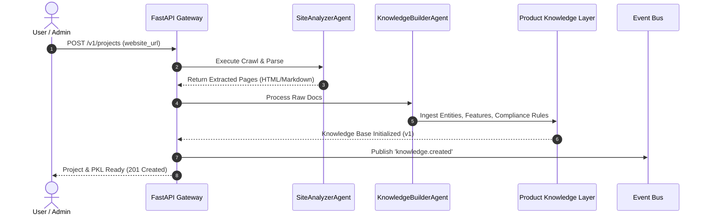
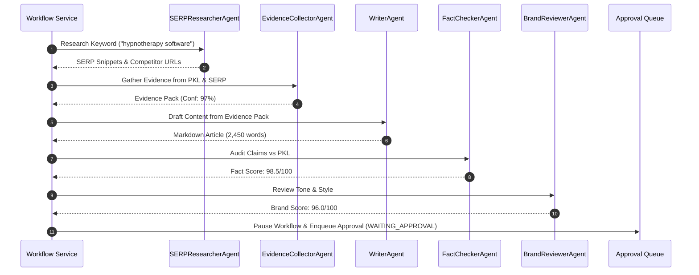

# AGOS Architecture — Sequence Diagrams

---

## 1. Workflow 1: Website Onboarding Sequence

```mermaid
sequenceDiagram
    autonumber
    actor User as User / Admin
    participant Gateway as FastAPI Gateway
    participant SiteAgent as SiteAnalyzerAgent
    participant KBAgent as KnowledgeBuilderAgent
    participant PKL as Product Knowledge Layer
    participant Bus as Event Bus

    User->>Gateway: POST /v1/projects (website_url)
    Gateway->>SiteAgent: Execute Crawl & Parse
    SiteAgent-->>Gateway: Return Extracted Pages (HTML/Markdown)
    Gateway->>KBAgent: Process Raw Docs
    KBAgent->>PKL: Ingest Entities, Features, Compliance Rules
    PKL-->>Gateway: Knowledge Base Initialized (v1)
    Gateway->>Bus: Publish 'knowledge.created'
    Gateway-->>User: Project & PKL Ready (201 Created)
```

---

## 2. Workflow 2: SEO Content Generation Pipeline Sequence

```mermaid
sequenceDiagram
    autonumber
    participant Engine as Workflow Service
    participant SERPAgent as SERPResearcherAgent
    participant EvAgent as EvidenceCollectorAgent
    participant Writer as WriterAgent
    participant Fact as FactCheckerAgent
    participant Brand as BrandReviewerAgent
    participant HITL as Approval Queue

    Engine->>SERPAgent: Research Keyword ("hypnotherapy software")
    SERPAgent-->>Engine: SERP Snippets & Competitor URLs
    Engine->>EvAgent: Gather Evidence from PKL & SERP
    EvAgent-->>Engine: Evidence Pack (Conf: 97%)
    Engine->>Writer: Draft Content from Evidence Pack
    Writer-->>Engine: Markdown Article (2,450 words)
    Engine->>Fact: Audit Claims vs PKL
    Fact-->>Engine: Fact Score: 98.5/100
    Engine->>Brand: Review Tone & Style
    Brand-->>Engine: Brand Score: 96.0/100
    Engine->>HITL: Pause Workflow & Enqueue Approval (WAITING_APPROVAL)
```
